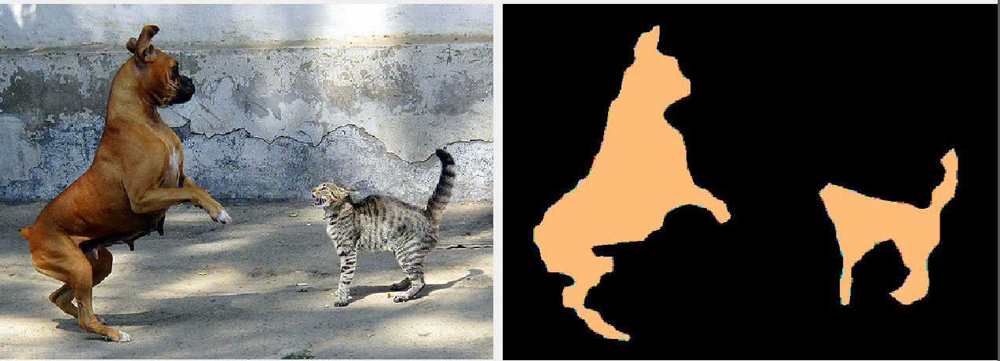
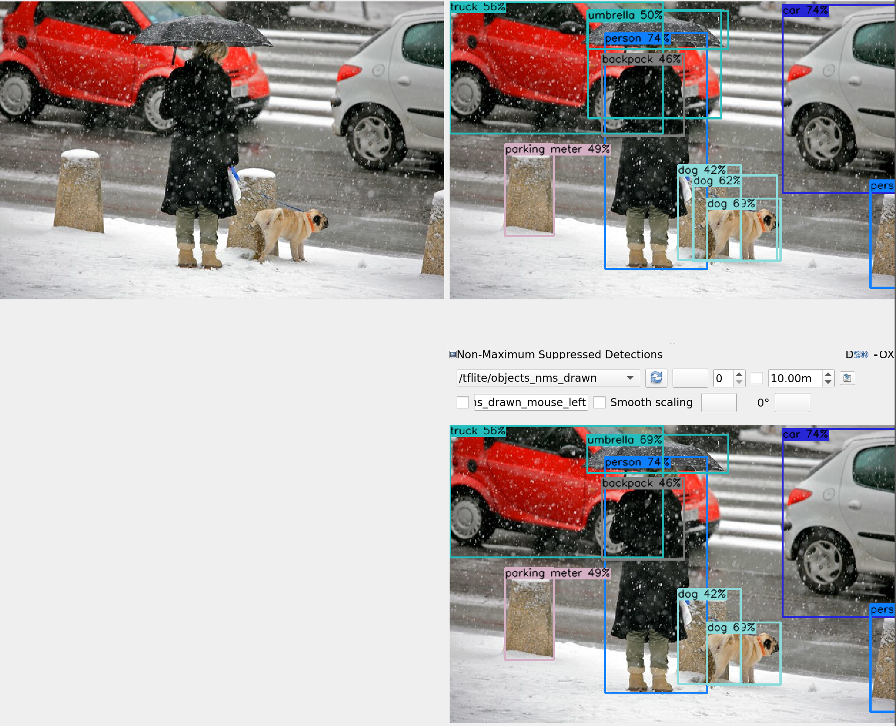

# ROS 2 Tensorflow Lite

The packages in this suite allow you to use [Tensorflow
Lite](https://www.tensorflow.org/lite) models in ROS 2. The aim is to
provide an easy way to run specially optimized models with ROS 2 on
many different types of hardware, including mobile phones, embedded
Linux devices, microcontrollers, and TPUs.

At the moment the focus is on computer vision models, with nodes
provided for image classification, semantic segmentation, and object
detection. Currently there is no intention to support other domains,
such as NLP, but contributions are welcomed!

Supported ROS 2 distribution: **ROS 2 Foxy Fitzroy**

## Building

The Tensorflow Lite library is required to use this project. There are
two ways to have this library provided.

### A. Build Tensorflow Lite library automatically

**N.B.** This method is mostly suited to compile and try out the nodes
in these packages on development machines. Building the library this
way directly on the target machine that Tensorflow Lite is aimed at
will in the best case take very long to finish, and in the worst case
just fail. Either way this method uses default build settings and may
not result in the most optimized output for your specific
platform. Use the alternative method below for building for/on your
robot's hardware.

By default, the `tflite` package will build the Tensorflow Lite
library automatically. For this the Tensorflow repository is added as
a submodule at `tflite/opt/tensorflow`. Make sure that the submodule
is initialized and updated; either clone this repository
(`ros2_tflite`) with:

    git clone --recurse-submodules

or if you already cloned the repository, with:

    cd ros2_tflite && git submodule update --init --recursive

Now building the `tflite` package with `colcon build` will build the
`libtensorflow-lite.a` library that gets statically linked into the
package's nodes.

### B. Use external library

To get maximum performance you want to use a version of the Tensorflow
Lite library that is optimized for your robot's hardware. You might
want to compile it directly on your robot, or cross-compile, but in
any case you probably want to ensure the right compiler optimization
flags are being used.

Tensorflow Lite provides several scripts to handle specific platforms,
for instance for
[ARM64](https://www.tensorflow.org/lite/guide/build_arm64) and
[Raspberry Pi](https://www.tensorflow.org/lite/guide/build_rpi). Check
the `build_*_lib.sh` scripts and the Makefile at
`tensorflow/lite/tools/make/Makefile` for details on how to possibly
tweak for your target platform (mostly by setting the `TARGET` make
variable).

Once you managed to build the library, copy the full `tensorflow` root
directory (i.e. including source and generated library) to your robot,
and then set two environment variables when building the `tflite`
package:

* `TENSORFLOW_SOURCE_DIR` - the full path to the root directory of the
  main tensorflow repository. For instance
  `<path_to_ros2_tflite>/tflite/opt/tensorflow` to use the submodule
  of this repository (will be set automatically in method A).
* `TENSORFLOW_LITE_LIB_DIR` - the full path of the directory
  containing the Tensorflow Lite static library file
  `libtensorflow-lite.a` (will be set automatically in method A). For
  instance
  `<path_to_ros2_tflite>/tflite/opt/tensorflow/tensorflow/lite/tools/make/gen/rpi_armv7`
  when building on a Raspberry Pi.

## Usage

The `tflite` package contains the main nodes. The `tflite_util` and
`tflite_example` packages contain some utility nodes and example
launch files. Note the following before trying the examples below:

* Make sure to run the `tflite_example/download_models.sh` script
  first to download the premade Tensorflow Lite models that are used,
  and run `colcon build` again to have them installed.

### Image Classification

The following launches an example of image classification, using the
[MobileNetV2](https://www.tensorflow.org/lite/models/image_classification/overview)
model:

    ros2 launch tflite_example example_mobilenet_v2_image.launch.py

This example launches the classification node, and the
`top_classification` utility node to output the top 3 classes for the
[sample image](tflite_example/images/wombat.jpg). To view this output
you can run:

    ros2 topic echo /tflite/classes_top

If you have a camera available, try the following example instead to
run the MobileNet model on live video:

    ros2 launch tflite_example example_mobilenet_v2_camera.launch.py

### Semantic Segmentation

The following launches an example of semantic segmentation, using the
[DeepLabv3+](https://www.tensorflow.org/lite/models/segmentation/overview)
model:

    ros2 launch tflite_example example_deeplab_image.launch.py

The example launches RQT and you should see the pixels of the
included example image labelled by class:

If you have a camera available, try the following example instead to
run the DeepLab model on live video:

    ros2 launch tflite_example example_deeplab_camera.launch.py

### Object Detection

The following launches an example of object detection, using the
[Mobilenet v2
SSD](https://www.tensorflow.org/lite/models/object_detection/overview)
model:

    ros2 launch tflite_example example_ssd_mobilenet_v2_image.launch.py

The example launches RQT and you should see the included example image, an output image with the raw object detections drawn on, and another with the detections after non-maximum suppression:

If you have a camera available, try the following example instead to
run the Mobilenet SSD model on live video:

    ros2 launch tflite_example example_ssd_mobilenet_v2_camera.launch.py

### Edge TPUs

All nodes support acceleration through using Google's [Coral Edge
TPU](https://coral.ai/) if the Edge TPU runtime is available at build
time (by default when compiling the package on the Coral Dev Board, or
[installed manually when using the USB
accelerator](https://coral.ai/docs/accelerator/get-started#1-install-the-edge-tpu-runtime)).

To enable usage of the TPU at runtime, set the `tflite` node's
`delegate` parameter to `edgetpu`. For example:

    ros2 run tflite object_detection_node --ros-args --param delegate:=edgetpu

Models that are explicitly optimized for the Edge TPU will fail to load otherwise.

See also the launch files with the `_edge` suffix in `tflite_example`.

### Node Composition

All nodes are registered as components and as such can be [composed
into a single
process](https://index.ros.org/doc/ros2/Tutorials/Composition/) with
other components. This is crucial to get good performance, by reducing
a lot of communication and copying overhead, most importantly between
the source of images and the `tflite` nodes.

The `example_ssd_mobilenet_v2_camera_composed_edge.launch.py` launch
file is provided as an example to show this effect. The non-composed
version is not able to achieve a throughput of more than 20 FPS on a
Coral Dev Board, even though model inference only takes 20 ms per
image. The version using composition in contrast manages to easily
keep up with a 30 FPS camera.

### Parameters

All example camera launch files support the following launch argument:

* `video_device` - `string`, default: `"/dev/video0"`

    Where to find the camera device to use as source. For instance
    required when using a USB camera on a Coral Dev Board, which will
    be at `/dev/video1`:
    
        ros2 launch tflite_example example_ssd_mobilenet_v2_camera_composed_edge.launch.py video_device:=/dev/video1

All `tflite` nodes support the following parameters:

* `input_offset` - `double`, default: `0.0`

    Offset subtracted from input values. For instance, set this to the
    input mean if the network is trained on standardized data with
    that mean.

* `input_scale` - `double`, default: `1.0`

    Scale the input values are divided by, after the offset above is
    applied.  For instance, set this to the input stndard deviation if
    the network is trained on standardized data with that
    deviation. Or set to 255.0 with an offset of 0 to scale input to
    be between 0 and 1.
